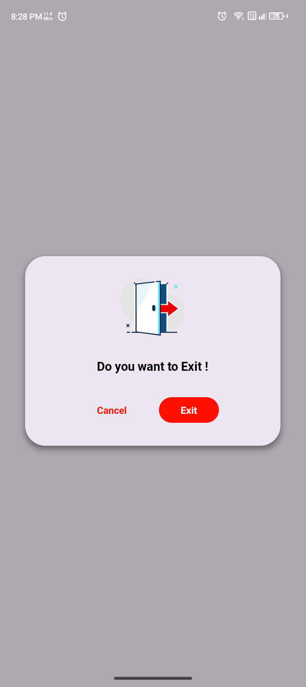
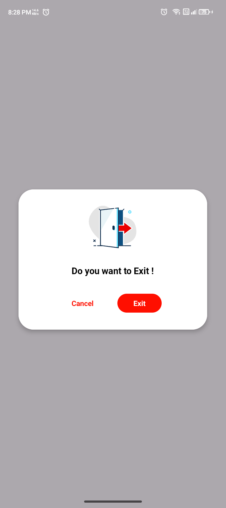

# 📌 ExitDialog            – Fast Exit Dialog

A powerful and easy-to-use Android library to handle **Exit Dialog** with clean APIs and modern Material dialogs.  

---

## ✨ Features  

### ⚙️ ExitDialog with Day Night
- ExitDialog with Material Design
- ExitDialog with Custom Material Design
- ExitDialog with Custom Design


---

## 🚀 Installation  

### LATEST-VERSION
[](https://jitpack.io/#ruhsoft-jakir/ExitDialog)


Add it in your `settings.gradle` at the end of repositories:
```gradle
//dependencyResolutionManagement {
//    repositoriesMode.set(RepositoriesMode.FAIL_ON_PROJECT_REPOS)
//    repositories {
//        google()
//        mavenCentral()
        maven { url 'https://jitpack.io' }
//    }
//}

```
Add on dependency via **Gradle**  `build.gradle`  (jitpack.io support):  

```gradle
dependencies {
	        implementation 'com.github.ruhsoft-jakir:ExitDialog:Tag'
}
```
#### LATEST-VERSION
[](https://jitpack.io/#ruhsoft-jakir/ExitDialog)


*(If not published yet, you can import `.aar` / `.module` locally.)*  

---

## 🛠 Usage  

### ⚙️ ExitDialog

Setup JAVA:
 ```java
                new Exit_Dialog_Custom(MainActivity.this).show();
 ```
or
 ```java
                new Exit_Dialog_Material(MainActivity.this).showDialog(false);
  ```
or
```java
                new Exit_Dialog_Material(MainActivity.this).showDialog(true);
 ```


MainActivity:
```java

 public class MainActivity extends AppCompatActivity {

    @Override
    protected void onCreate(Bundle savedInstanceState) {
        super.onCreate(savedInstanceState);
        EdgeToEdge.enable(this);
        setContentView(R.layout.activity_main);
        ViewCompat.setOnApplyWindowInsetsListener(findViewById(R.id.main), (v, insets) -> {
            Insets systemBars = insets.getInsets(WindowInsetsCompat.Type.systemBars());
            v.setPadding(systemBars.left, systemBars.top, systemBars.right, systemBars.bottom);
            return insets;
        });

        getOnBackPressedDispatcher().addCallback(new OnBackPressedCallback(true) {
            @Override
            public void handleOnBackPressed() {
                new Exit_Dialog_Custom(MainActivity.this).show();
                new Exit_Dialog_Material(MainActivity.this).showDialog(false);
                new Exit_Dialog_Material(MainActivity.this).showDialog(true);
            }
        });
    }
}
```


## 🎨 UI/UX  

- Material Design dialogs  
- Lottie animations (`.raw` resources) for dialog
 
---

## 🎥 Demo  

Here’s how it looks in action 👇  

 
### ⚙️ Special Access  


| Device Admin Access                         | All Files Access                              | Usage Access                             |
|---------------------------------------------|-----------------------------------------------|---------------------------------------------|
|  |  |  |
---

## 🤝 Contributing  

Pull requests are welcome! If you find any bug or missing permission, open an issue or create a PR.  

---

## 📜 License  

This library is released under the **MIT License**.  
